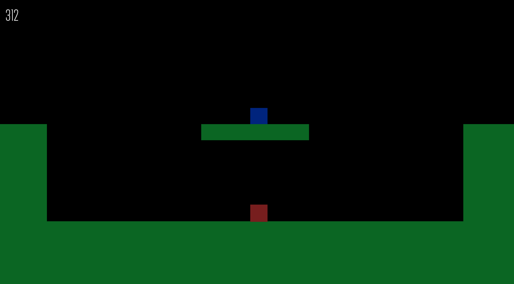

# 2D Platformer Prototype

### General information

This project is a 2D platformer coded from scratch in Python using the PyGame library.

## Preview

<a href="https://www.youtube.com/watch?v=bYbD1c4v_ko" target="_blank">Video Showcase</a>

## Features

Player
- Moving by pressing `A` and `D`
- Looking up or down by pressing `W` and `S`
- Jumping by pressing `space`
- Double jumping by pressing `space` in the air
- Wall sliding by touching a wall while falling
- Wall jumping by pressing `space` while wall sliding
- Dashing by pressing `shift`

Enemy
- Moves towards the player at all times
